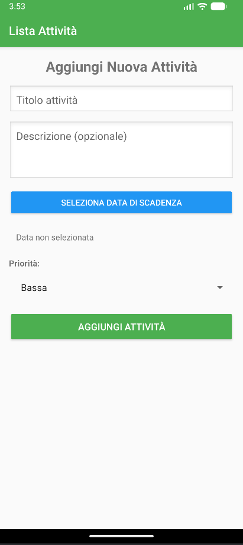
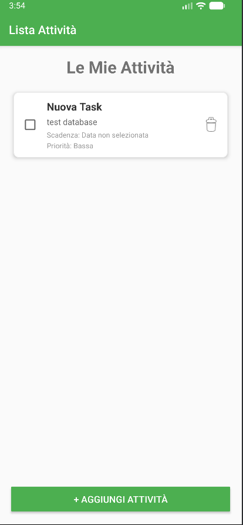

# Lista Attività - To Do List App

Un'applicazione Android moderna per gestire le tue attività quotidiane con facilità.

## Caratteristiche

- ✅ Aggiungi nuove attività con titolo, descrizione, data di scadenza e priorità
- ✅ Segna le attività come completate
- ✅ Elimina attività indesiderate
- ✅ Interfaccia intuitiva e user-friendly
- ✅ Database locale SQLite per la persistenza dei dati
- ✅ Completamente in italiano

## Struttura del Progetto

```
ListaAttivita/
├── app/
│   ├── src/
│   │   ├── main/
│   │   │   ├── java/com/yuri/listaattivita/
│   │   │   │   ├── Attivita.java          # Modello dati
│   │   │   │   ├── ContrattoAttivita.java # Contratto database
│   │   │   │   ├── GestoreDatabase.java   # Gestione database
│   │   │   │   ├── AdapterAttivita.java   # Adapter RecyclerView
│   │   │   │   ├── MainActivity.java      # Schermata principale
│   │   │   │   └── AggiungiAttivitaActivity.java # Aggiungi attività
│   │   │   ├── res/
│   │   │   │   ├── layout/
│   │   │   │   ├── values/
│   │   │   │   ├── drawable/
│   │   │   │   └── xml/
│   │   │   └── AndroidManifest.xml
│   │   └── test/
│   └── build.gradle
├── build.gradle
└── settings.gradle
```

## Requisiti

- Android SDK 24 (Android 7.0) o superiore
- Android Studio 4.1 o superiore
- Java 8

## Installazione

1. Clona o scarica il progetto
2. Apri il progetto in Android Studio
3. Sincronizza il progetto con i file di Gradle
4. Esegui l'app su un emulatore o dispositivo

## Come Usare

1. **Aprire l'app**: Avvia l'applicazione
2. **Aggiungere attività**: Premi il pulsante "+ Aggiungi Attività"
3. **Compilare i dettagli**:
   - Inserisci il titolo (obbligatorio)
   - Aggiungi una descrizione (opzionale)
   - Seleziona la data di scadenza
   - Scegli il livello di priorità
4. **Salvare**: Premi "Aggiungi Attività"
5. **Gestire**: 
   - Spunta la casella per completare un'attività
   - Premi l'icona del cestino per eliminarla

## Tecnologie Utilizzate

- **Android Framework**: AppCompat, RecyclerView
- **Database**: SQLite
- **UI**: Material Design
- **Linguaggio**: Java

## Screenshots
<p align="center">
  
  
</p>

## Autore

Fierro Yuri

## Licenza

Progetto aperto a usi personali e didattici.
